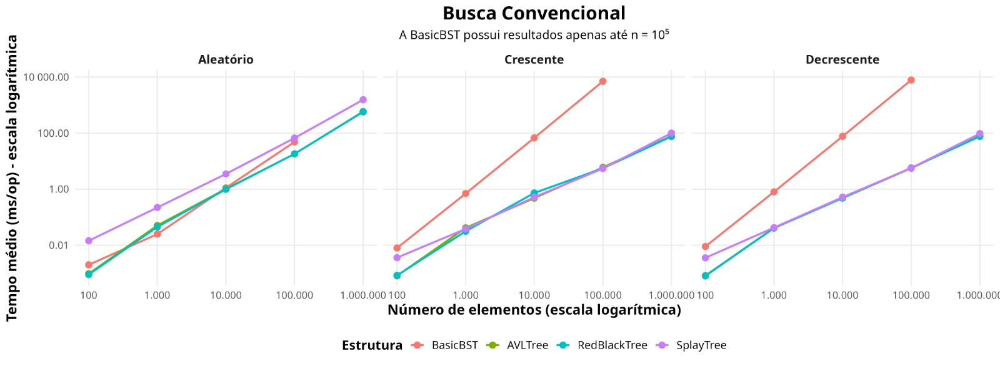
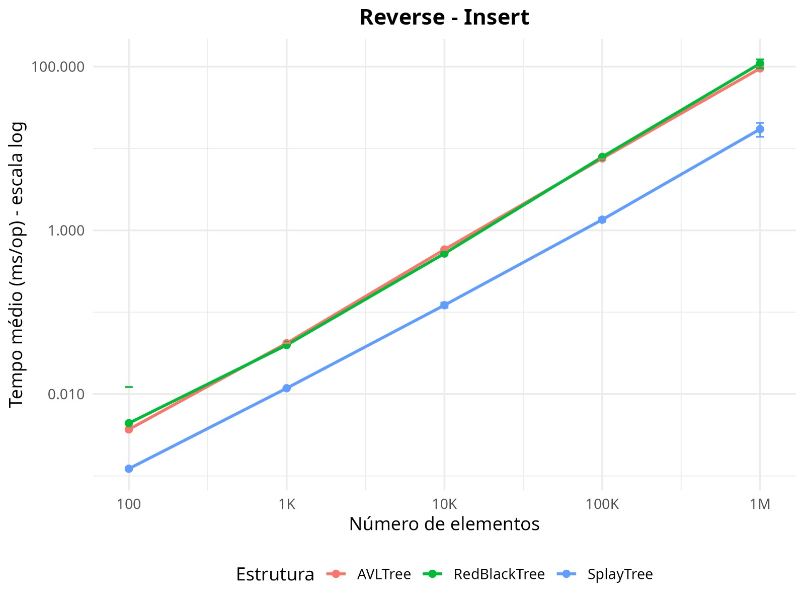
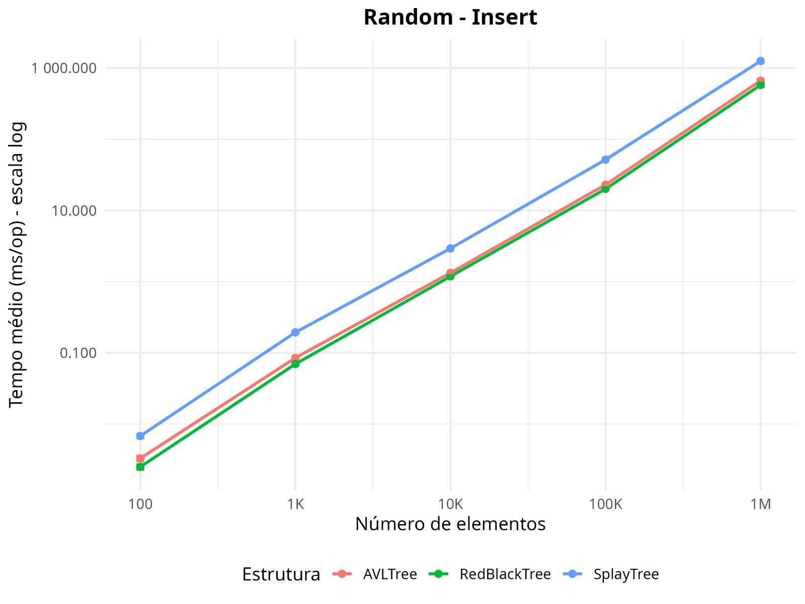
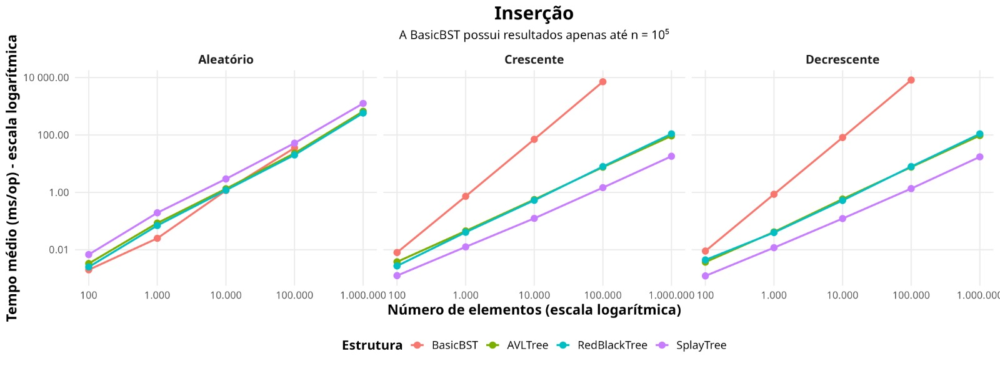
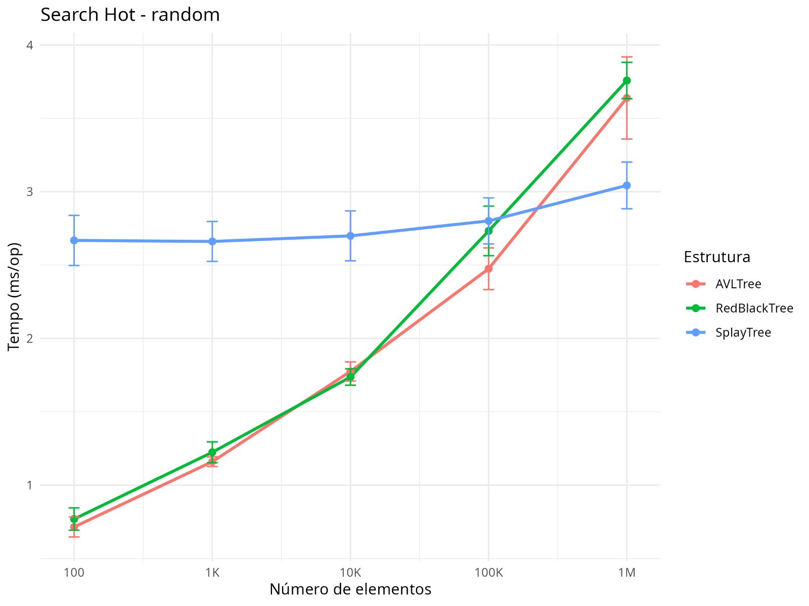
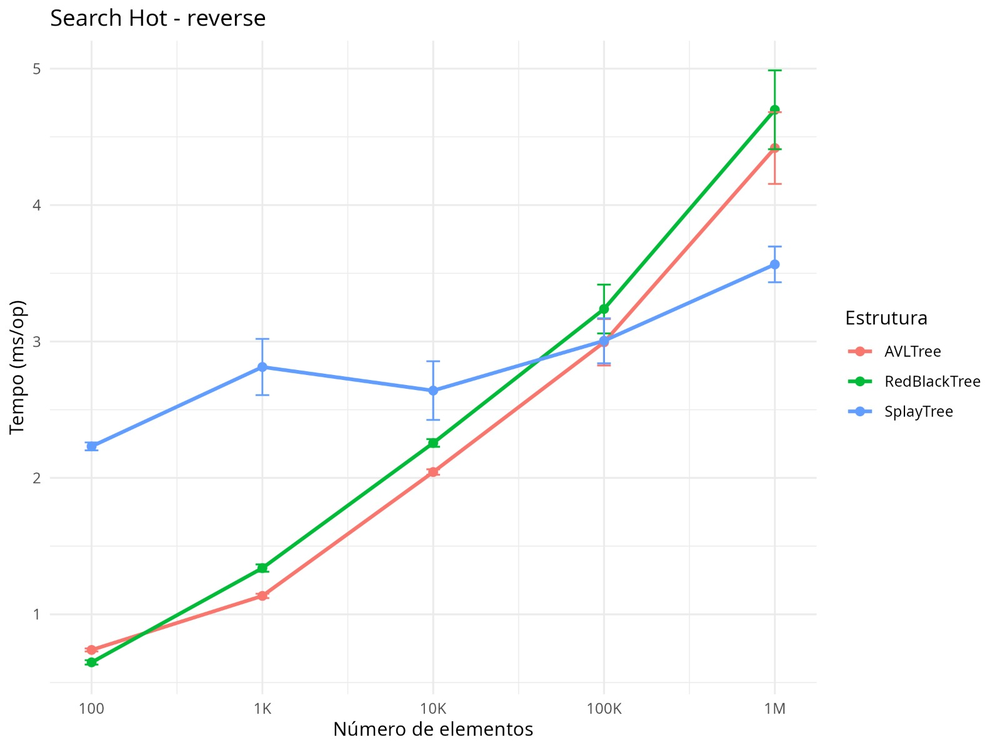
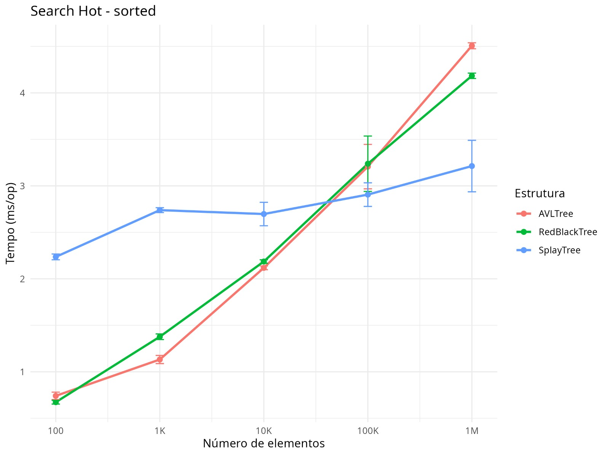

# splay-tree-analysis

Esse repositório contém a experimentação feita sobre a Splay Tree, sua implementação, sua comparação com a eficácia de outras árvores de busca binária e outros experimentos adicionais (Com bases de dados reais, por exemplo.)

## Objetivo
O objetivo deste projeto é analisar o funcionamento e a utilidade da Splay Tree, avaliando a eficiência de suas operações sob diferentes fatores de cargas e distribuições de dados. Buscando identificar cenários em que sua utilização se torna eficiente e vantajosa em relação a outras árvores binárias de pesquisa balanceadas.

## Como rodar os experimentos

### Requisitos: <br>
* Java <br>
* Maven <br>
* Mínimo de 8 GB de memória RAM (recomendado 16 GB para os experimentos com maiores conjuntos de dados)

### Execução:
```bash
java -jar target/benchmarks.jar
java -jar target/benchmarks.jar InsertAndSearchBenchmark 
java -jar target/benchmarks.jar HotSearchBenchmark
```
## Metodologia

Nesse sentido, a execução dos experimentos se baseou em 3 etapas: <br>
* Implementação das estruturas que serão comparadas. <br>
* Geração das cargas de testes. <br>
* Análise de desempenho das estruturas quando as cargas são aplicadas.
<br>
#### 1. Implementação das estruturas de dados: <br>
Para possibilitar uma comparação da Splay Tree com outras árvores de pesquisa, foram implementadas as seguintes estruturas: AVL Tree, Red-Black Tree, BST (Binary Search Tree) básica; Splay Tree. <br>
Todas as estruturas implementam a mesma interface de operações, permitindo que sejam submetidas aos mesmos experimentos e condições de teste.

#### 2. Geração das cargas de testes: <br>
As cargas de testes utilizadassão geradas automaticamente e adicionadas no diretório DataSets. Foram considerados tamanhos de entrada variando de 10² até 10⁶ elementos.

Além disso, foram gerados conjuntos de dados contendo:

   * Números aleatórios;
   * Números em ordem crescente;
   * Números em ordem decrescente.

#### 3. Análise de desempenho das estruturas quando as cargas são aplicadas.
A análise de desempenho foi realizada por meio da medição dos tempos de execução das operações das estruturas para cada conjunto de dados. <br>
Inicialmente, foi desenvolvido um benchmark próprio para automatizar os testes, mas, posteriormente, os experimentos passaram a utilizar o JMH (Java Microbenchmark Harness), proporcionando medições mais confiáveis. <br>
Além do uso do JMH, foram adotadas estratégias para reduzir interferências externas durante as medições, como a realização de sequências de aquecimento (warmup), para minimizar o impacto da lentidão das execuções iniciais. Foram realizadas 100 execuções de cada experimento, descartando as 25 primeiras para o warmup, possibilitando o cálculo do tempo médio de execução e da margem de erro estatística.

## Resultados

### 1\. Busca Convencional
Nos testes de busca convencional, a AVL Tree e a Red-Black Tree apresentaram desempenhos bastante semelhantes para os três conjuntos de dados (random, sorted e reverse). A Splay Tree apresentou tempos próximos aos dessas estruturas para os conjuntos sorted e reverse em entradas acima de 1.000 elementos. Entretanto, para entradas menores nesses conjuntos e para todos os tamanhos do conjunto random, a Splay Tree apresentou tempos superiores aos da AVL Tree e da Red-Black Tree.

Esse comportamento é esperado, pois cada operação de busca na Splay Tree realiza o procedimento de splay, reorganizando a árvore após o acesso. Nesses cenários, em que não há forte repetição de acessos, o custo adicional das rotações acaba não sendo compensado por ganhos de desempenho, principalmente em entradas de menor ordem.

Por outro lado, a BST básica apresentou desempenho inferior às demais estruturas, principalmente para os conjuntos sorted e reverse, devido à ausência de mecanismos de balanceamento. Apenas no conjunto random seu desempenho permaneceu relativamente próximo ao das árvores balanceadas.



### 2\. Inserção

Nos testes de inserção, a AVL Tree e a Red-Black Tree mantiveram tempos de execução bastante semelhantes entre si, enquanto a BST básica apresentou desempenho próximo ao das demais apenas para o conjunto random. Entretanto, nos conjuntos sorted e reverse seu tempo de execução cresceu rapidamente, tendo em vista que essas distribuições representam seus piores casos, levando à formação de uma árvore degenerada.

A Splay Tree apresentou maior custo para o conjunto random, consequência do procedimento de autoajuste executado após cada inserção. Por outro lado, para os conjuntos sorted e reverse, obteve desempenho significativamente superior ao das demais estruturas.

 

Esse comportamento da Splay Tree pode ser explicado pelo fato de que, nesse padrão de entrada, o elemento recém-inserido é adicionado como raiz, caso a árvore esteja vazia, ou como filho da raiz (à esquerda, para o conjunto reverse, e à direita, para o conjunto sorted), fazendo com que seja necessária apenas uma ou nenhuma rotação para promovê-lo até a raiz. Dessa forma, o custo de cada inserção, nos cenários avaliados com elementos ordenados em ordem crescente ou decrescente, aproxima-se de um custo constante, o que explica o melhor desempenho observado experimentalmente. 



### 3\. Search Hot
Nos experimentos de Search Hot, nos quais um conjunto de 10 elementos é acessado repetidamente, a Splay Tree apresentou vantagem em relação às demais árvores para entradas de maior tamanho. Esse comportamento ocorre porque, após as primeiras buscas, as rotações realizadas pela operação splay aproximam da raiz os elementos mais frequentemente acessados, reduzindo o custo amortizado das buscas subsequentes. <br>
Entretanto, para conjuntos de dados menores, o custo adicional das rotações supera os benefícios proporcionados pelo autoajuste da estrutura. Como as árvores AVL e Red-Black não modificam sua estrutura durante as operações de busca, elas apresentaram menores tempos de execução nesses cenários. <br>
Nos experimentos realizados, observou-se que, para o conjunto reverse, a Splay Tree ainda apresentava desempenho inferior para entradas de 10.000 elementos, mas passou a superar as demais estruturas para 100.000 elementos. Para o conjunto sorted, verificou-se comportamento semelhante, indicando que a transição também ocorre entre 10.000 e 100.000 elementos. Já para o conjunto random, a Splay Tree somente apresentou vantagem entre 100.000 e 1.000.000 elementos. Assim, os resultados indicam que a vantagem da Splay Tree passa a se manifestar apenas para entradas suficientemente grandes. <br>
Dessa forma, conclui-se que, em cenários com forte localidade de referência, o mecanismo de autoajuste da Splay Tree torna-se progressivamente mais eficiente à medida que o tamanho da entrada aumenta. Nessas situações, o benefício obtido ao aproximar da raiz os elementos mais acessados passa a compensar o custo adicional das rotações. <br>





## Ameaças à validade
**1\.** Benchmarks dependem fortemente de hardware, SO, JVM e configurações da máquina virtual, então, mesmo com uso do JMH, os resultados podem variar se replicados em diferentes máquinas.

**2\.** Os experimentos utilizaram apenas três distribuições de dados (aleatória, crescente e decrescente) e um cenário específico de buscas repetidas (Hot Search). Em aplicações reais, outros padrões de acesso podem produzir resultados diferentes.

**3\.** Os experimentos foram realizados apenas para tamanhos específicos de entrada. Assim, quando foi observada uma mudança de desempenho entre duas estruturas, não foi possível determinar exatamente o ponto em que essa transição ocorre, apenas que ela está compreendida entre os tamanhos de entrada testados.

**4\.** A BST básica não foi testada para as maiores entradas, pois, em seus piores casos (dados ordenados), o crescimento quadrático do tempo de execução tornou inviável a realização dos experimentos. Assim, sua comparação com as demais estruturas ficou limitada aos menores tamanhos de entrada.

## Conclusões Finais
A análise realizada permitiu compreender o funcionamento da Splay Tree e comparar seu desempenho com outras árvores binárias de pesquisa. Os resultados mostraram que a principal vantagem da Splay Tree está em sua capacidade de reorganizar automaticamente a árvore conforme o padrão de acesso, aproximando os elementos mais acessados para próximo da raiz. Isso permite que o custo amortizado seja reduzido em aplicações com forte localidade de referência. <br>
Por outro lado, para situações em que os acessos são distribuídos de maneira uniforme entre todos os elementos, a Splay Tree não apresenta grandes vantagens, muitas vezes sendo até mesmo pior que outras árvores, tendo em vista que ela sempre reorganiza a árvore.
Dessa forma, conclui-se que a Splay Tree não substitui necessariamente as árvores balanceadas tradicionais, mas é uma alternativa interessante para aplicações em que determinados elementos são acessados repetitivamente. Nesses casos, seu mecanismo de auto ajuste pode proporcionar ganhos de desempenho.

---
Este material foi elaborado por [Kauã José](https://github.com/Kaua-Jose153), [Roan Motta](https://github.com/roanmotta) , [Jhonnata Mikael](https://github.com/Jhonnata011), e [André Mikael](https://github.com/andremikaelpc).